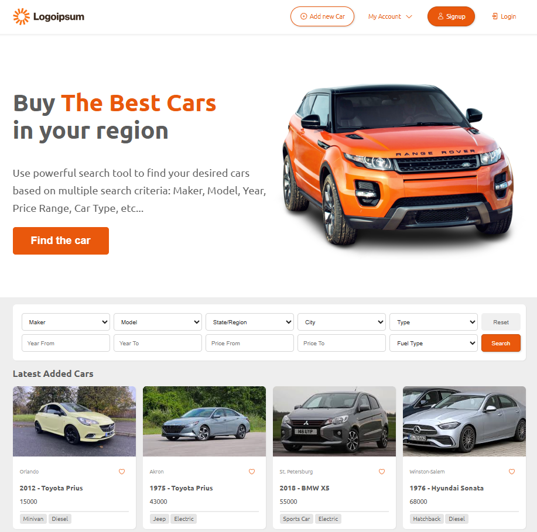
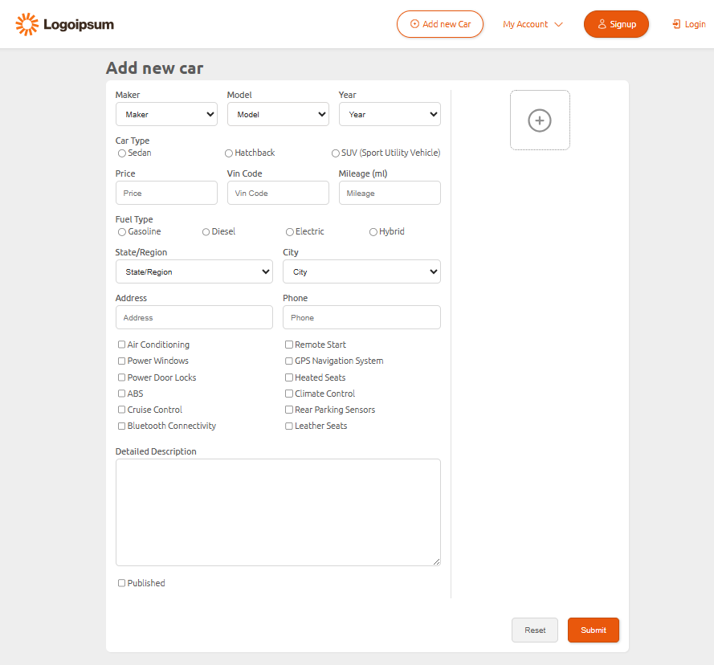
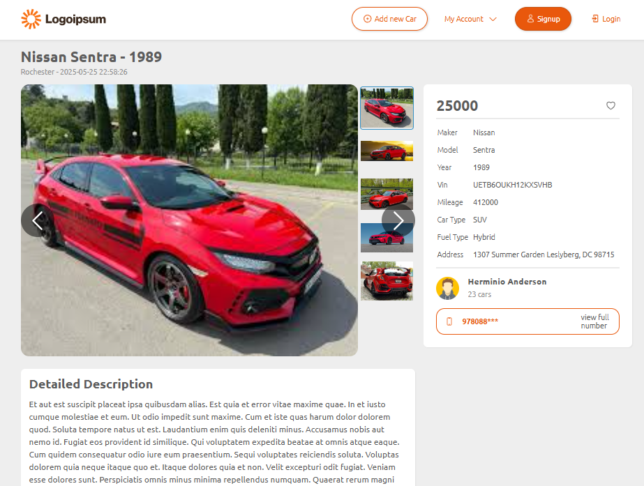
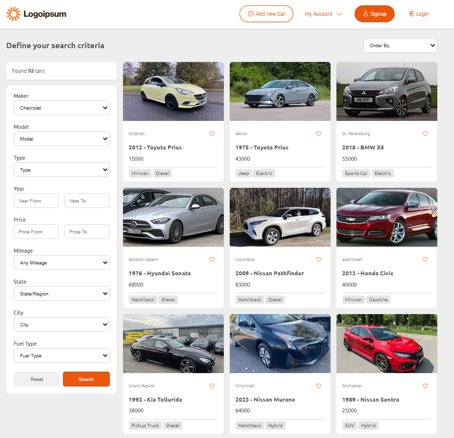

# 🚗 Car Selling Website – Full-Stack Project

A modern car-selling website constructed with HTML, CSS, Laravel (PHP), and SQLite. With complete image support, comprehensive specs, and search options, users can browse, filter, and post auto listings. While the frontend provides a responsive and seamless experience, the backend manages intricate relationships using Laravel's Eloquent ORM.

---
 

## 🔑 Key Features

- 🔐 User Auth via Phone / Google / Facebook
- 🧾 Add/Edit Cars with
- ❤️ Favorite Cars for logged-in users
- 🧭 Search Filters:
- 📸 Image gallery per car

---
 

## 🛠️ Tech Stack

- **HTML, CSS**: Responsive, mobile-friendly UI design
- **PHP (Laravel)**: MVC framework for routing, logic, and security
- **SQLite**: Lightweight, file-based relational DB
- **ORM**: Handles complex model relationships in Laravel

---
 

## 📸 Screenshots

  <table>
    <tr>
      <td align="center">
         
        <b>Home Page</b>
      </td>
      <td align="center">
         
        <b>Adding new car page</b>
      </td>
      <td align="center">
         
        <b>Car details</b>
      </td>
      <td align="center">
         
        <b>Car details</b>
      </td>
    </tr>
    
  </table>

---
 

